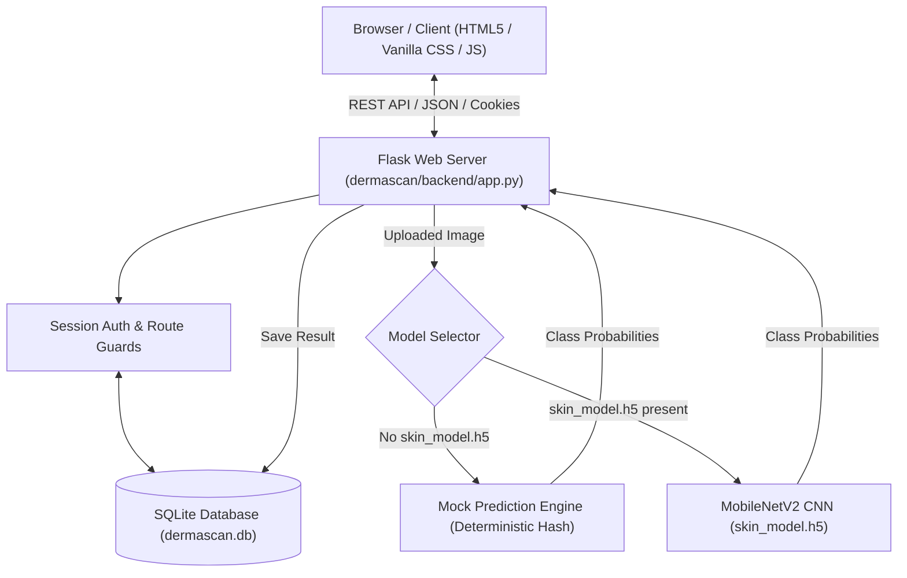

# 🩺 DermaScan AI — Intelligent Skin Disease Classification & Dashboard

[](https://www.python.org/)
[](https://flask.palletsprojects.com/)
[](https://www.sqlite.org/)
[]()

**DermaScan AI** is an end-to-end intelligent dermatology platform featuring AI-powered skin disease classification, user session authentication, personalized clinical dashboards, scan history tracking, and an interactive dermatology assistant bot with a modern 3D glassmorphic web interface.

---

## 📑 Table of Contents

- [Overview](#-overview)
- [Key Features](#-key-features)
- [Project Architecture](#-project-architecture)
- [Repository Structure](#-repository-structure)
- [Getting Started](#-getting-started)
  - [Prerequisites](#prerequisites)
  - [Installation](#installation)
  - [Running the Web Application](#running-the-web-application)
- [Running via Jupyter Notebook / Google Colab](#-running-via-jupyter-notebook--google-colab)
- [Deploying to Vercel](#-deploying-to-vercel)
- [API Endpoints](#-api-endpoints)
- [Machine Learning Model](#-machine-learning-model)
  - [Dual Prediction Modes](#dual-prediction-modes)
  - [Supported Disease Classes](#supported-disease-classes)
  - [Training Your Own Model](#training-your-own-model)
- [Security & Authentication](#-security--authentication)
- [Medical Disclaimer](#-medical-disclaimer)

---

## 🌟 Overview

DermaScan AI bridges the gap between machine learning computer vision and healthcare accessibility. Designed as an assistive tele-dermatology tool, it allows users to upload dermatological lesion images, receive instant condition classifications with confidence intervals, view historical health trends on a personal dashboard, and consult an AI assistant for symptom guidance.

---

## 🚀 Key Features

- **🧠 AI Skin Disease Classifier**:
  - Image preprocessing and normalization pipeline (`224x224` resolution).
  - Transfer learning architecture based on **MobileNetV2** (ImageNet pre-trained).
  - Detailed probability breakdown across conditions (Acne, Eczema, Melanoma, Psoriasis).
  - Automatic fallback to high-fidelity **Mock Simulation Mode** when running in environments without pre-trained model weights or GPU acceleration.

- **🔐 User Authentication & Session Security**:
  - User registration and login powered by Werkzeug password hashing (scrypt).
  - Secure session-cookie authentication.
  - Client-side navigation guards preventing unauthorized access to protected dashboard and prediction routes.

- **📊 Personal Analytics Dashboard**:
  - Scan statistics (total scans, condition distribution percentages).
  - Chronological scan history table displaying timestamps, predicted conditions, and confidence levels.

- **💬 AI Dermatology Assistant**:
  - Interactive chat interface for quick symptom triage, general skincare guidance, and disease inquiries.

- **🎨 Modern Responsive UI**:
  - Built with pure Semantic HTML5, Vanilla CSS (Glassmorphism, dark palette, smooth micro-animations), and modular Vanilla JavaScript.
  - Zero heavy external frontend frameworks required.

---

## 🏗 Project Architecture



---

## 📁 Repository Structure

```text
DermaScan/
├── api/
│   └── index.py                              # Vercel serverless entrypoint (WSGI wrapper)
├── public/                                   # High-speed static assets served via Vercel Edge CDN
│   ├── index.html, dashboard.html, ...       # Frontend pages
│   ├── css/style.css                         # Global glassmorphism styles & animations
│   └── js/                                   # Frontend scripts (auth, dashboard, predict, bot)
├── vercel.json                               # Vercel deployment configuration (routes & cleanUrls)
├── .vercelignore                             # Deployment ignore list (excludes bulky dev files)
├── requirements.txt                          # Lean production & Vercel serverless dependencies
├── requirements-train.txt                    # Offline ML training dependencies (TF, Kaggle, CV2)
├── README.md                                 # Project documentation
└── dermascan/
    ├── backend/                              # Python Flask backend & SQLite layer
    │   ├── app.py                            # Main Flask server & REST API
    │   ├── db.py                             # Serverless-aware SQLite layer (/tmp support)
    │   ├── model.py                          # CNN architecture (MobileNetV2)
    │   ├── utils.py                          # Image preprocessing (Pillow & CV2 fallback)
    │   └── dermascan.db                      # SQLite database file
    └── frontend/                             # Source frontend files (synced with public/)
```

---

## ⚡ Getting Started

### Prerequisites

- **Python 3.9+** installed on your system.
- Git (optional, for cloning).

### Installation

1. **Clone or navigate to the repository directory**:
   ```bash
   cd "C:\Users\sivak\Desktop\Cybernaut Internship\DermaScan"
   ```

2. **Create a virtual environment (Recommended)**:
   ```bash
   # Windows (PowerShell)
   python -m venv venv
   .\venv\Scripts\Activate.ps1

   # macOS / Linux
   python3 -m venv venv
   source venv/bin/activate
   ```

3. **Install the required dependencies**:
   ```bash
   pip install -r requirements.txt
   ```

---

### Running the Web Application

1. **Start the Flask backend**:
   ```bash
   python dermascan/backend/app.py
   ```

2. **Access the application**:
   Open your browser and navigate to:
   👉 **[http://localhost:5000](http://localhost:5000)** (or `http://127.0.0.1:5000`)

3. **Stop the server**:
   Press `Ctrl + C` in the terminal to shut down the server.

---

## 📓 Running via Jupyter Notebook / Google Colab

The repository includes `DermaScan_v3_LoginDashboardBot (1).ipynb` which can generate and run the entire project in a single notebook:

1. **Locally in VS Code / Jupyter**:
   - Open `DermaScan_v3_LoginDashboardBot (1).ipynb`.
   - Select your Python kernel.
   - Click **Run All**. The notebook extracts all frontend/backend files and launches the server.

2. **In Google Colab**:
   - Upload `DermaScan_v3_LoginDashboardBot (1).ipynb` to [Google Colab](https://colab.research.google.com/).
   - Run all cells. In Step 5 & 6, an **ngrok** tunnel is automatically provisioned to give you a public URL to share and test.

---

## ☁️ Deploying to Vercel

DermaScan AI is fully pre-configured for **1-click serverless deployment** to [Vercel](https://vercel.com/):
- **Static Assets**: Automatically served via Vercel's global Edge CDN from `public/`.
- **Serverless API**: Python Flask REST backend runs seamlessly on AWS Lambda via `api/index.py`.
- **Database**: Ephemeral `/tmp` SQLite handling with auto-seeding allows testing dynamic features (signup, login, scans, history) without read-only filesystem errors.
- **Lean Bundle Size**: Production dependencies (<60MB) are optimized to respect Vercel's 250MB uncompressed bundle limit.

### Method 1: Deploy via GitHub (Recommended)

1. **Push your code to GitHub**:
   ```bash
   git add .
   git commit -m "Configure DermaScan for Vercel deployment"
   git push origin main
   ```
2. **Import into Vercel**:
   - Go to [vercel.com/new](https://vercel.com/new).
   - Select and import your `DermaScan` repository.
   - **Framework Preset**: Leave as **Other** (Vercel automatically detects `vercel.json` and `api/index.py`).
   - **Root Directory**: `./` (default).
3. **Environment Variables (Optional)**:
   - Add `DERMASCAN_SECRET_KEY`: Enter a random secure string for production session signing.
4. **Deploy**:
   - Click **Deploy**. In under a minute, your application will be live at `https://your-project.vercel.app`!

---

### Method 2: Deploy via Vercel CLI

1. **Install Vercel CLI**:
   ```bash
   npm install -g vercel
   # or run directly with npx
   ```
2. **Deploy to Preview**:
   ```bash
   vercel
   ```
   Follow the interactive prompts to link your project.
3. **Deploy to Production**:
   ```bash
   vercel --prod
   ```

---

## 🔌 API Endpoints

| Method | Endpoint | Access | Description |
|---|---|---|---|
| `GET` | `/` | Public | Serves the landing page (`index.html`) |
| `POST` | `/api/signup` | Public | Register new user `{name, email, password}` |
| `POST` | `/api/login` | Public | Authenticate user `{email, password}` |
| `POST` | `/api/logout` | Session | Terminate session |
| `GET` | `/api/me` | Session | Retrieve active user profile |
| `POST` | `/api/predict` | Protected | Multipart image upload for AI diagnosis |
| `GET` | `/api/dashboard/stats` | Protected | Fetch scan counts, condition breakdown, and history |
| `POST` | `/api/contact` | Public | Submit contact form feedback `{name, email, message}` |
| `GET` | `/api/health` | Public | Health check indicating server & model status |

---

## 🔬 Machine Learning Model

### Dual Prediction Modes

- **Trained Model Mode (`trained_model`)**:
  When `skin_model.h5` exists in `dermascan/backend/`, the system loads weights into the MobileNetV2 network and performs true deep learning inference.
- **Mock Mode (`mock`)**:
  When running locally without a pre-trained model file or GPU, the system generates deterministic, reproducible mock diagnosis results based on image pixel sums, allowing full UI/UX testing without large weight files.

### Supported Disease Classes (HAM10000)

1. **Actinic Keratosis** (`akiec`)
2. **Basal Cell Carcinoma** (`bcc`)
3. **Benign Keratosis** (`bkl`)
4. **Dermatofibroma** (`df`)
5. **Melanocytic Nevi** (`nv`)
6. **Vascular Lesion** (`vasc`)
7. **Melanoma** (`mel`)

### Training the Model

The training script automatically fetches the dataset via `kagglehub`, balances the classes, trains the MobileNetV2 transfer learning model, and saves `skin_model.h5`:

```bash
python dermascan/backend/train.py
```

Once saved to `dermascan/backend/skin_model.h5`, running `python dermascan/backend/app.py` loads the trained model:
```text
[DermaScan] Loaded trained model from .../skin_model.h5
```

---

## 🔒 Security & Authentication

- Passwords are encrypted using Werkzeug's `generate_password_hash` with `scrypt` key derivation.
- Session IDs are signed with Flask's secret key (`DERMASCAN_SECRET_KEY` environment variable).
- Routes `/api/predict` and `/api/dashboard/stats` are protected by a `@login_required` decorator.

---

## ⚠️ Medical Disclaimer

> **IMPORTANT**: DermaScan AI is developed strictly for **educational, academic, and research demonstration purposes**. It is not a certified medical device and should **never** be used as a substitute for clinical diagnosis, professional medical advice, or treatment from a qualified dermatologist. Always consult a licensed healthcare provider for any skin health concerns.
